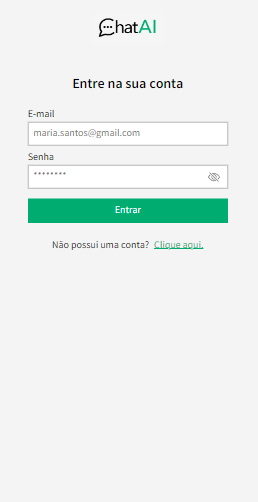
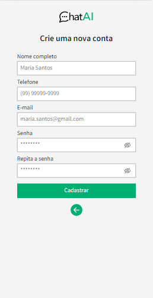
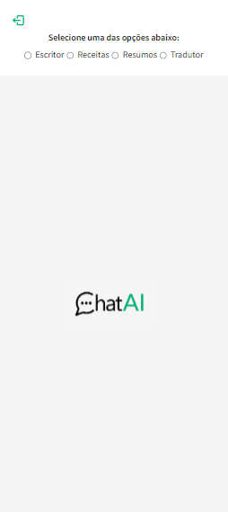
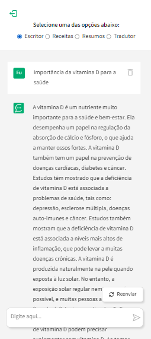
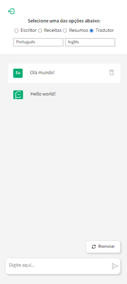

<h1 align="center">Front-end - ChatAI: Inspyred by ChatGPT</h1>

## ℹ️ About
This is a chat that consumes data from an API developed by me. The link of the github repository is: https://github.com/francinehahn/gpt-api-backend

The back-end consumes data from the openAI api and the layout is responsive to all screen sizes.

## 🌐 Deploy

## 👩‍💻 Technologies
- Typescript
- Next.js
- Sass
- Axios
- Nookies

## ☑️ Functionalities
- `Login/Signup Page:`
    - Login
    - User registration
    - Input validation
    - Authentication
- `Home Page:`
    - Recipes generator: the user provides a list of ingrdients and the chatAI returns a recipe
    - Text generator: the user provides a subject and the chatAI returns a text
    - Summary generator: the user provides a text and the chatAI returns a summary of it
    - Translator: the user provides a text, a source language and a target language and the chatAI returns the translation
    - Regenerate: the user can regenerate the last answer of the chatAI by clicking on a button
    - Deletion: the user can delete any of the questions/answers

## 📷 Images

 

## 🛰 Running the project
<pre>
    <code>git clone https://github.com/francinehahn/gpt-api-frontend.git</code>
</pre>

<pre>
    <code>cd gpt-api-frontend</code>
</pre>

<pre>
  <code>npm install</code>
</pre>

<pre>
  <code>npm run start</code>
</pre>
